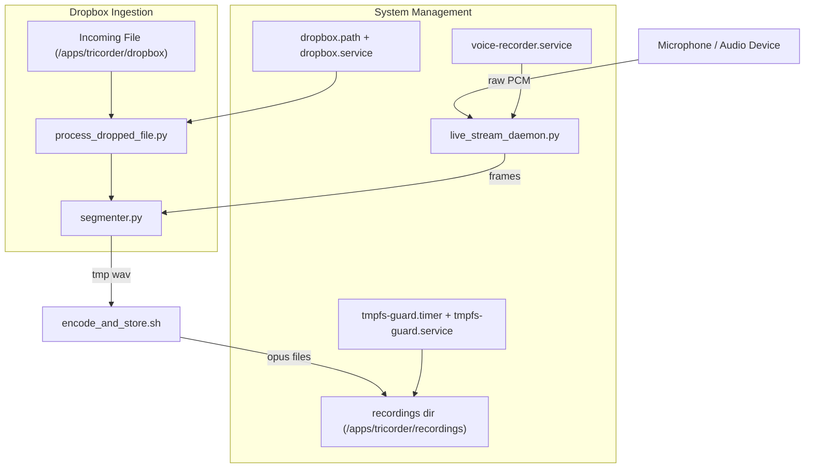

# Tricorder

Tricorder is an embedded audio event recorder designed to run continuously on a Raspberry Pi Zero 2 W.  
It listens to audio input, segments interesting activity using WebRTC VAD, encodes detected events to Opus,  
and stores them locally. Also supports dropping externally recorded events into this project's processing pipeline
for processing. 

This project is designed for **single-purpose deployment** on a dedicated device.

Note: This project is pinned to Python ≥3.10 with requirements.txt to ensure consistent builds on Raspberry Pi Zero 2W 
(armhf/arm64 wheels).

---

## Features

- Continuous low-power audio monitoring on RPi Zero 2 W
- WebRTC-based voice activity detection at 48 kHz / 20 ms frames
- Efficient encoding with `ffmpeg` (Opus @ ~48 kbps, mono)
- Event-based segmentation with pre- / post-roll context
- Systemd-managed services for recording, encoding, storage, and syncing
- Automatic tmpfs space guard and log rotation

---

## Why the name “Tricorder”?

The name is both a nod to the *Star Trek* tricorder (a portable device that continuously scans and records signals)  
and a literal description of this project’s **three core recording functions**:

1. **Audio-triggered recording** – capture events only when the input exceeds a sound threshold.  
2. **Voice Activity Detection (VAD)** – segment speech and other meaningful sounds from noise.  
3. **External file ingestion** – process/ingest external recordings, trimming away uninteresting parts automatically.

---

# Tricorder Architecture



---

## Project Structure

```text
Folders
-------
tricorder/
  bin/                # Shell utilities
  lib/                # Core Python modules
  systemd/            # Systemd unit files
  
Layout
------
tricorder/
├── README.md
├── requirements.txt
├── install.sh
├── clear_logs.sh
├── main.py
├── __init__.py
├── .gitignore
├── .gitattributes
│
├── bin/
│ ├── encode_and_store.sh
│ └── tmpfs_guard.sh
│
├── lib/
│ ├── __init__.py
│ ├── fault_handler.py
│ ├── live_stream_daemon.py
│ ├── process_dropped_file.py
│ └── segmenter.py
│
└── systemd/
├── voice-recorder.service
├── dropbox.service
├── dropbox.path
├── tmpfs-guard.service
└── tmpfs-guard.timer

```
---

## Testing

This project uses **pytest** for unit and end-to-end testing.

### Run all tests
```bash
pytest -v
```

### Test categories
- **Unit tests**: `tests/test_segmenter.py`, `tests/test_fault_handler.py`
- **Dropbox ingestion**: `tests/test_dropbox.py` (verifies processing of external files)
- **End-to-end**: `tests/test_end_to_end.py` (generates WAV → pipeline → validates Opus output)

### CI/CD
In CI pipelines, add:
```yaml
- name: Run tests
  run: pytest -v --maxfail=1 --disable-warnings
```

Tests write to `/apps/tricorder/recordings` and temporary paths under `/tmp`. Ensure these are writable in your CI environment.

---

## Installation

1. Flash Ubuntu 24.04 LTS onto an SD card. Boot and connect to network.
2. Copy/Clone this repo onto the Pi. (not the installation directory)
3. Run the installer:
   ```bash
   ./install.sh
   ```
   This will install dependencies, set up a Python venv, and register systemd services. It willl also nable and start services
   
---

## Configuration

This project now uses a unified YAML file for configuration. Load order:
1. /etc/tricorder/config.yaml
2. /apps/tricorder/config.yaml
3. ./config.yaml (project root)

Environment variables override the file when set (e.g., DEV=1, AUDIO_DEV, GAIN, REC_DIR, TMP_DIR, DROPBOX_DIR, INGEST_*).

Key sections in config.yaml:
- audio: device, sample_rate, frame_ms, gain, vad_aggressiveness
- paths: tmp_dir, recordings_dir, dropbox_dir, ingest_work_dir, encoder_script
- segmenter: pre- / post-pads, RMS threshold, debounce, and buffer settings
- ingest: stability checks and file filters
- logging: dev_mode toggle (equivalent to DEV=1)

---

## Services

- `voice-recorder.service` → runs the recorder daemon and segments audio into events
- `dropbox.path` + `dropbox.service` → monitor Dropbox folder and ingest files from it
- `tmpfs-guard.timer` + `tmpfs-guard.service` → ensure tmpfs doesn’t fill beyond threshold
- `clear_logs.sh` → legacy; prefers journald size limits (utility script not a service)

---

## Usage

- Logs can be monitored with:
  ```bash
  journalctl -u voice-recorder.service -f
  ```
- Recordings will appear under `/apps/tricorder/recordings`.
- To test the pipeline, a self-test service/script will be added (see TODO).

---

## TODO (next improvements)

- [ ] Make `/apps/tricorder` paths configurable via environment variables (e.g., `REC_DIR`, `TMP_DIR`).
- [x] Harden `dropbox.service` ingestion loop to avoid race with partial files.
- [x] Gate debug logging behind environment variable to reduce journald volume.
- [x] Move all tunables, params, and config options to a unified config file.
- [x] Add unit and e2e tests self-test script/service to generate a wav file, encode it, and verify an event end-to-end when any code changes.
- [x] RMS room measurement helper tool for audio volume.
- [x] auto denoising while transcoding to opus... test trimming out silence as well.
- [x] Move all tunables, params, and config options to a unified config file.
- [ ] Add RMS level that triggers a recording event as meta data in filename with postfix eg. *_Both_RMS-<int>_1.opus
---

## Contributing

This project is optimized for embedded deployment. Keep changes minimal, efficient, and mindful of Pi Zero 2 W constraints (CPU, RAM, storage).
