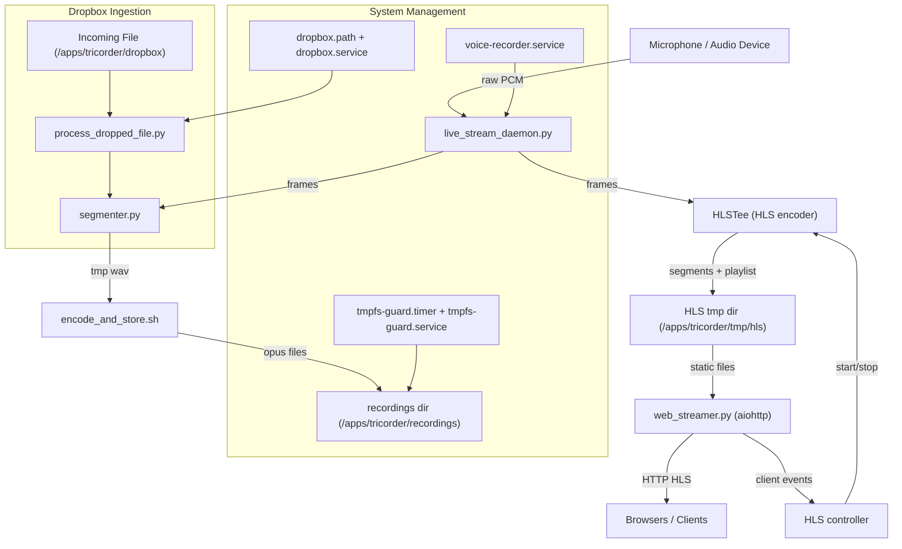

# Tricorder

Tricorder is an embedded audio event recorder designed to run continuously on a Raspberry Pi Zero 2 W.  
It listens to audio input, segments interesting activity using WebRTC VAD, encodes detected events to Opus,  
and stores them locally. Also supports dropping externally recorded events into this project's processing pipeline
for processing. 

This project is designed for **single-purpose deployment** on a dedicated device.

Note: This project is pinned to Python ≥3.10 with requirements.txt to ensure consistent builds on Raspberry Pi Zero 2W 
(armhf/arm64 wheels).

---

## Features

- Continuous low-power audio monitoring on RPi Zero 2 W
- WebRTC-based voice activity detection at 48 kHz / 20 ms frames
- Efficient encoding with `ffmpeg` (Opus @ ~48 kbps, mono)
- Event-based segmentation with pre- / post-roll context
- Adaptive RMS threshold tracking that follows background noise and recovers when rooms quiet down
- Systemd-managed services for recording, encoding, storage, and syncing
- On-demand HLS web streaming of the live microphone feed with automatic
  start/stop when listeners connect or disconnect
- Automatic tmpfs space guard and log rotation
- Optional systemd auto-update service to keep deployments current without manual pulls

---

## Why the name “Tricorder”?

The name is both a nod to the *Star Trek* tricorder (a portable device that continuously scans and records signals)  
and a literal description of this project’s **three core recording functions**:

1. **Audio-triggered recording with Voice Activity Detection (VAD) tagging** – capture events when the input exceeds a sound threshold and/or speech is detected.  
2. **Live Network Streaming** – HLS live streaming of audio from the device microphone to any web browser.   
3. **External file ingestion** – process/ingest external recordings, trimming away uninteresting parts automatically.

---

# Tricorder Architecture



## Live HLS Web Streaming

Real-time listening is handled by a lightweight HLS pipeline that only runs
while someone is tuned in:

- `live_stream_daemon.py` instantiates `HLSTee` but leaves it idle until
  requested. Audio frames are always fed so a warm encoder can spin up quickly.
- `web_streamer.py` is an `aiohttp` server that serves `/hls/live.m3u8` and the
  generated segments, plus a simple dashboard that shows listener counts.
- `hls_controller` tracks active clients and starts the encoder on the first
  listener, then schedules a cooldown stop once the audience drops to zero.

HLS artifacts (playlist + `.ts` segments) live under `<tmp_dir>/hls`
(defaults to `/apps/tricorder/tmp/hls`). `ffmpeg`'s `-hls_flags delete_segments`
keeps this directory self-pruning.

### Running the streamer locally

```bash
python -m lib.web_streamer --host 0.0.0.0 --port 8080
```

Visit `http://<device>:8080/hls` to listen. The page automatically calls
`/hls/start` and `/hls/stop` so the encoder powers up only when needed. During
local development `python main.py` launches both the recorder loop and the web
streamer in tandem.

---

## Project Structure

```text
Folders
-------
tricorder/
  bin/                # Shell utilities
  lib/                # Core Python modules
  systemd/            # Systemd unit files
  
Layout
------
tricorder/
├── README.md
├── requirements.txt
├── install.sh
├── clear_logs.sh
├── main.py
├── __init__.py
├── .gitignore
├── .gitattributes
│
├── bin/
│ ├── encode_and_store.sh
│ └── tmpfs_guard.sh
│
├── lib/
│ ├── __init__.py
│ ├── config.py
│ ├── fault_handler.py
│ ├── hls_controller.py
│ ├── hls_mux.py
│ ├── live_stream_daemon.py
│ ├── process_dropped_file.py
│ ├── segmenter.py
│ └── web_streamer.py
│
└── systemd/
├── voice-recorder.service
├── dropbox.service
├── dropbox.path
├── tmpfs-guard.service
└── tmpfs-guard.timer

```
---

## Testing

This project uses **pytest** for unit and end-to-end testing.

### Run all tests
```bash
pytest -v
```

### Test categories
- **Unit tests**: `tests/test_10_segmenter.py`, `tests/test_20__fault_handler.py`
- **Dropbox ingestion**: `tests/test_30_dropbox.py` (verifies processing of external files)
- **End-to-end**: `tests/test_40_end_to_end.py` (generates WAV → pipeline → validates Opus output)
- **Installer / cleanup**: `tests/test_00_install.py`, `tests/test_50_uninstall.py`
- **HLS streaming controls**: `tests/test_60_hls.py` (on-demand encoder + client lifecycle)

### CI/CD
In CI pipelines, add:
```yaml
- name: Run tests
  run: pytest -v --maxfail=1 --disable-warnings
```

Tests write to `/apps/tricorder/recordings` and temporary paths under `/tmp`. Ensure these are writable in your CI environment.

---

## Installation

1. Flash Ubuntu 24.04 LTS onto an SD card. Boot and connect to network.
2. Copy/Clone this repo onto the Pi. (not the installation directory)
3. Run the installer:
   ```bash
   ./install.sh
   ```
   This will install dependencies, set up a Python venv, and register systemd services. It willl also nable and start services
   
---

## Configuration

This project now uses a unified YAML file for configuration. Load order:
1. /etc/tricorder/config.yaml
2. /apps/tricorder/config.yaml
3. ./config.yaml (project root)

Environment variables override the file when set (e.g., DEV=1, AUDIO_DEV, GAIN, REC_DIR, TMP_DIR, DROPBOX_DIR, INGEST_*, ADAPTIVE_RMS_*).

Key sections in config.yaml:
- audio: device, sample_rate, frame_ms, gain, vad_aggressiveness
- paths: tmp_dir, recordings_dir, dropbox_dir, ingest_work_dir, encoder_script
- segmenter: pre- / post-pads, RMS threshold, debounce, and buffer settings
- adaptive_rms: rolling background tracker that raises/lowers the RMS trigger based on recent noise levels
- ingest: stability checks and file filters
- logging: dev_mode toggle (equivalent to DEV=1)

### Adaptive RMS controller

The adaptive controller monitors a rolling window of RMS samples to track the current background floor. When enabled it:

1. Estimates the 95th percentile (configurable) of the recent background to form a **raise candidate** threshold.
2. Remembers the last quiet window to compute a **release candidate** so the trigger can fall quickly once loud noise subsides.
3. Applies hysteresis to avoid noisy oscillations and clamps stale values when most frames are silent.

Relevant configuration keys:

| Field                               | Description                                                                                   |
|-------------------------------------|-----------------------------------------------------------------------------------------------|
| `adaptive_rms.enabled`              | Turn the controller on. When `false`, the fixed `segmenter.rms_threshold` is used.            |
| `adaptive_rms.min_thresh`           | Lower bound on the normalized RMS threshold (keep above background hiss).                     |
| `adaptive_rms.margin`               | Multiplier applied to the raise candidate percentile to determine the live threshold.         |
| `adaptive_rms.update_interval_sec`  | How often background statistics are sampled for potential adjustments.                        |
| `adaptive_rms.window_sec`           | Size of the lookback window used to estimate background energy.                               |
| `adaptive_rms.hysteresis_tolerance` | Minimum relative delta before a new threshold is published.                                   |
| `adaptive_rms.release_percentile`   | Percentile used when releasing after a loud room quiets down (smaller values recover faster). |

All adaptive knobs also accept environment overrides (`ADAPTIVE_RMS_ENABLED`, `ADAPTIVE_RMS_MIN_THRESH`, `ADAPTIVE_RMS_MARGIN`, `ADAPTIVE_RMS_UPDATE_INTERVAL_SEC`, `ADAPTIVE_RMS_WINDOW_SEC`, `ADAPTIVE_RMS_HYSTERESIS_TOLERANCE`, `ADAPTIVE_RMS_RELEASE_PERCENTILE`). Use `room_tuner.py` to visualize the running thresholds while dialing them in for a space.

---

## Services

- `voice-recorder.service` → runs the recorder daemon and segments audio into events
- `dropbox.path` + `dropbox.service` → monitor Dropbox folder and ingest files from it
- `tmpfs-guard.timer` + `tmpfs-guard.service` → ensure tmpfs doesn’t fill beyond threshold
- `tricorder-auto-update.timer` + `tricorder-auto-update.service` → periodically fetch the main branch and reinstall when updates land
- `clear_logs.sh` → legacy; prefers journald size limits (utility script not a service)

### Dashboard service controls

The management dashboard now exposes start/stop/reload controls for a curated set of systemd units. Configure the list under `dashboard.services` in `config.yaml`; each entry accepts a `unit` name plus optional `label` and `description` shown in the UI. Example:

```yaml
dashboard:
  services:
    - unit: "voice-recorder.service"
      label: "Recorder"
      description: "Segments microphone input into individual events."
    - unit: "web-streamer.service"
      label: "Web UI"
      description: "Serves the dashboard and HLS live stream."
  web_service: "web-streamer.service"
```

Units listed in `dashboard.web_service` are automatically restarted when a stop or reload action is requested so the dashboard stays reachable even if the web process is cycled. Override the defaults via:

- `DASHBOARD_SERVICES="unit|Label|Description;other.service|Other"`
- `DASHBOARD_WEB_SERVICE="web-streamer.service"`

Entries are separated by semicolons; optional `|label|description` segments override the UI text for each unit.

---

## Automatic updates

The auto-updater runs as `tricorder-auto-update.timer`, which wakes `tricorder-auto-update.service` every 30 minutes (after a 10
minute boot delay). The service clones a configurable Git remote, runs `install.sh`, and restarts the active daemons when a new
commit is detected.

Create `/etc/tricorder/update.env` with at least the repository URL:

```bash
sudo tee /etc/tricorder/update.env >/dev/null <<'EOF'
TRICORDER_UPDATE_REMOTE=https://github.com/you/tricorder.git
# Optional overrides:
# TRICORDER_UPDATE_BRANCH=main
# TRICORDER_UPDATE_DIR=/var/lib/tricorder-updater
# TRICORDER_INSTALL_BASE=/apps/tricorder
# TRICORDER_UPDATE_SERVICES="voice-recorder.service web-streamer.service dropbox.service"
EOF
sudo systemctl daemon-reload
sudo systemctl enable --now tricorder-auto-update.timer
```

The timer is enabled automatically by `install.sh`, but the snippet above is helpful when updating an existing deployment. To
trigger an immediate run:

```bash
sudo systemctl start tricorder-auto-update.service
```

Set `DEV=1` in the unit environment to disable auto-updates (useful on development systems).

---

## Usage

- Logs can be monitored with:
  ```bash
  journalctl -u voice-recorder.service -f
  ```
- Recording filenames follow:
  ```
  <HH>-<MM>-<SS>_<TYPE>_RMS-<LEVEL>_<N>.opus
  ```
  - `<HH>-<MM>-<SS>` — wall-clock start time (24h) when the trigger fired.
  - `<TYPE>` — classifier outcome once the segment ended: `Both` (RMS + VAD), `Human` (VAD only), or `Other` (RMS only).
  - `RMS-<LEVEL>` — instantaneous RMS value that first crossed the RMS threshold and started the event.
  - `<N>` — per-second counter so multiple triggers in the same second stay unique.
- Recordings will appear under `/apps/tricorder/recordings`.
- To test the pipeline, a self-test service/script will be added (see TODO).

---

## TODO (next improvements)

- [ ] Make `/apps/tricorder` paths configurable via environment variables (e.g., `REC_DIR`, `TMP_DIR`).
---

## Contributing

This project is optimized for embedded deployment. Keep changes minimal, efficient, and mindful of Pi Zero 2 W constraints (CPU, RAM, storage).
