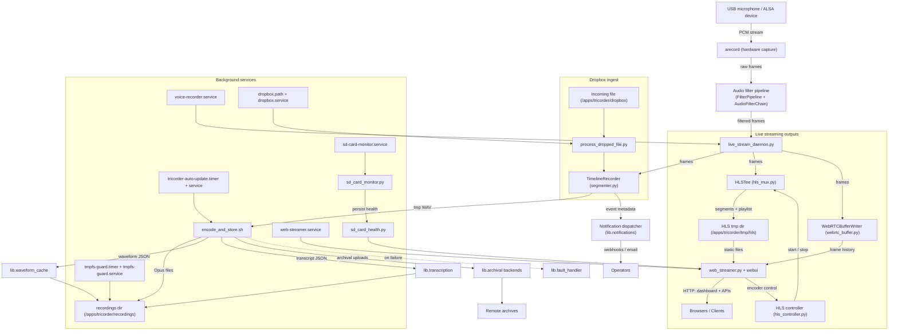
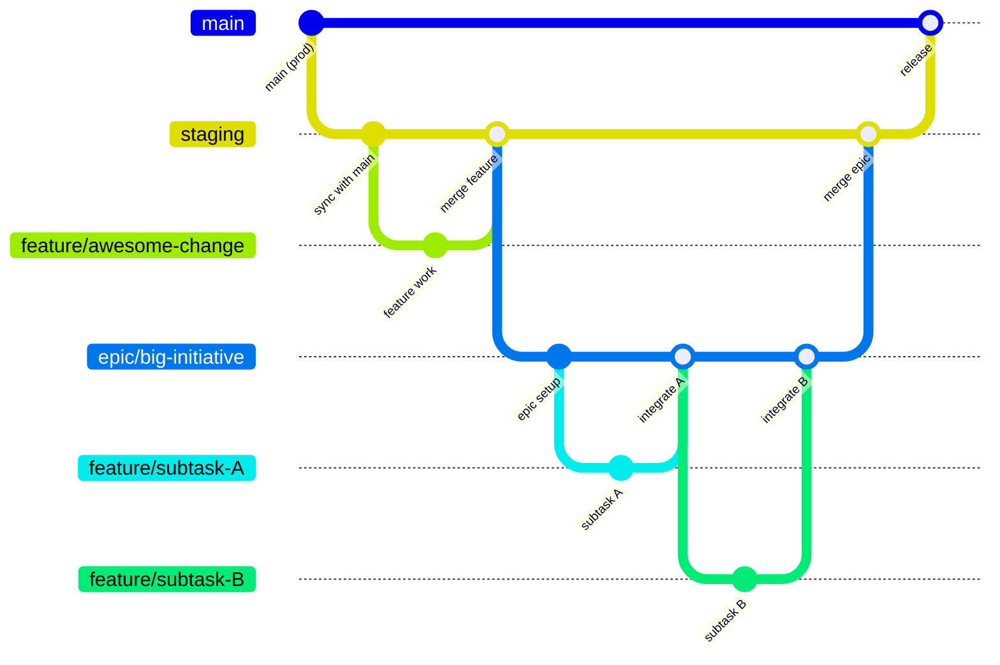

# Tricorder

Tricorder is an embedded audio event recorder designed for 24/7 capture on a Raspberry Pi Zero 2 W. It listens to a mono ALSA input, segments interesting activity with WebRTC VAD, encodes events to Opus, and serves them through an on-device dashboard and HLS stream.

This project targets **single-purpose deployments** on low-power hardware. The runtime is pinned to Python&nbsp;3.10 via `requirements.txt` to ensure wheel availability for the Pi Zero 2&nbsp;W.

---

## Highlights

- Continuous audio capture with adaptive RMS tracking and configurable VAD aggressiveness.
- Event segmentation with pre/post roll, asynchronous encoding, and automatic waveform sidecars for fast preview rendering.
- Optional offline speech-to-text transcripts for Human-tagged events with dashboard keyword search across recordings.
- Live streaming via HLS or optional WebRTC mode that powers up only when listeners are present and tears down when idle.
- Web dashboard (aiohttp + Jinja) for monitoring recorder state, browsing recordings, previewing audio + waveform, deleting files, and inspecting configuration.
- Dropbox-style ingest path for external recordings that reuses the segmentation + encoding pipeline.
- Optional archival uploads to mounted network shares or rsync-over-SSH targets right after encoding.
- Systemd-managed services and timers, including optional automatic updates driven by `tricorder_auto_update.sh`.
- Persistent SD card health monitoring with automatic dashboard warnings when the card reports errors.
- Utilities for deployment (`install.sh`), cleanup (`clear_logs.sh`), and environment tuning (`room_tuner.py`).

---

## Why the name “Tricorder”?

The name is both a nod to the *Star Trek* tricorder (a portable device that continuously scans and records signals)  
and a literal description of this project’s **three core recording functions**:

1. **Audio-triggered recording with Voice Activity Detection (VAD) tagging** – capture events when the input exceeds a sound threshold and/or speech is detected.  
2. **Live Network Streaming** – HLS or WebRTC live streaming of audio from the device microphone to any web browser.
3. **External file ingestion** – process/ingest external recordings, trimming away uninteresting parts automatically.

---

## Architecture



Frames originate on the USB microphone (or other ALSA device) and are pulled across the USB bus by an `arecord` subprocess that `live_stream_daemon.py` supervises. Each PCM frame flows through the following stages:

1. **Capture guardrails** – `live_stream_daemon.py` restarts `arecord` on failure and preserves frame ordering so downstream queues never see duplicates.
2. **Filter offload** – `FilterPipeline` ships frames to a helper process that runs the configured `AudioFilterChain`. This keeps DSP work off the capture loop while still surfacing filter failures back to the supervisor.
3. **Fan-out hub** – the daemon forwards filtered frames to two destinations:
   - `TimelineRecorder` in `lib.segmenter` for event detection, WAV staging, notification dispatch, and coordination with `bin/encode_and_store.sh`.
   - `HLSTee` / `WebRTCBufferWriter` so live listeners can attach without disturbing capture cadence.
4. **Encoding + storage** – the encoder script writes Opus files, waveform JSON, transcript sidecars, and now preserves the source WAV in `/apps/tricorder/recordings/.original_wav/<YYYYMMDD>/`. It then kicks off post-encode archival backends via `lib.archival` and relies on `lib.fault_handler` to triage any encoding failures.

`lib.hls_controller` brokers HLS encoder lifecycles on behalf of the dashboard, while the WebRTC branch keeps a bounded history buffer that the browser drains when establishing a peer connection. Dropbox ingest feeds the same timeline recorder, guaranteeing that external files experience identical filtering, encoding, waveform generation, and transcription steps.

---

## Systemd units and helpers

| Unit / Script | Purpose |
| --- | --- |
| `voice-recorder.service` | Runs `live_stream_daemon.py` for continuous capture and segmentation. |
| `web-streamer.service` | Hosts the aiohttp dashboard + streaming endpoints (HLS/WebRTC) (`lib/web_streamer.py`). |
| `sd-card-monitor.service` | Monitors kernel/syslog for SD card errors and keeps the dashboard warning banner in sync. |
| `dropbox.path` / `dropbox.service` | Watches `/apps/tricorder/dropbox` and processes externally provided recordings. |
| `tmpfs-guard.timer` / `tmpfs-guard.service` | Enforces tmpfs usage/rotation to prevent storage exhaustion. |
| `tricorder-auto-update.timer` / `tricorder-auto-update.service` | Periodically run `bin/tricorder_auto_update.sh` to pull and install updates. |
| `bin/encode_and_store.sh` | Invoked by the segmenter to encode WAV captures to Opus and call `lib.waveform_cache`. |
| `bin/tmpfs_guard.sh` | Cleans tmpfs + recording directories when the guard timer fires. |
| `bin/tricorder_auto_update.sh` | Git-pulls the configured remote, runs `install.sh`, then restarts core services. |
| `room_tuner.py` | Interactive console utility to dial in RMS thresholds and VAD aggressiveness for new rooms. |
| `main.py` | Development launcher that stops the systemd recorder, runs the live daemon in the foreground, and serves the dashboard on port 8080. |

`updater.env-example` documents the environment file expected by the auto-update service (`/etc/tricorder/update.env`). Update this file whenever new updater tunables are introduced.

---

### Branching Model

The repository follows a **staging-first** workflow that mirrors production while allowing controlled integration and testing.

- **`main`**  
  Represents the production branch. All code in `main` is considered deployable and reflects what is running in production.

- **`staging`**  
  Always kept in sync with `main`. It acts as a production-equivalent environment for final validation before release.  
  All feature and fix branches are opened against `staging` rather than `main`.

- **Feature Branches**  
  Create feature branches from `staging` for individual changes or fixes. These branches are merged back into `staging` once reviewed and approved.

- **Epic / Pre-Integration Branches**  
  For large or multi-contributor efforts, create a dedicated **pre-integration branch** from `staging`.  
  This branch serves as a temporary integration point for multiple related feature branches.  
  Once the combined work is stable and tested, the epic branch is merged into `staging` for final integration and testing with upstream `main`.

- **Release Flow**  
  1. Feature branches → `staging`  
  2. Final verification → merge `staging` → `main`  
  3. Deploy from `main`



---

## Automatic archival uploads

Freshly encoded recordings can be mirrored off-device for long-term storage using the new archival plug-ins. Configure the `archival` section in `config.yaml` to enable one of the backends (or open the dashboard’s ☰ menu → **Archival settings** to edit the same options in the UI — changes stay in sync with `config.yaml`):

- **`network_share`** — copies files to a local mount (SMB/NFS/etc.). Point `archival.network_share.target_dir` at the mounted root and the recorder will mirror the per-day folder layout when pushing new files.
- **`rsync`** — streams files to a remote SSH host using `rsync`. Set `archival.rsync.destination` (e.g. `user@server:/backups/tricorder`). Optional keys let you provide a dedicated SSH identity (`ssh_identity`), extra rsync arguments (`options`), and additional SSH flags (`ssh_options`).

Waveform sidecars are skipped by default; enable `archival.include_waveform_sidecars` to upload the JSON previews alongside the audio.
Transcript sidecars are archived by default so backups stay searchable; set `archival.include_transcript_sidecars` to `false` to opt out.

Uploads run immediately after the encoder finishes so recordings land in the archive while they are still hot in the filesystem cache. Failures are logged but do not block the local store, keeping the recorder resilient to temporary network outages.

---

## Web dashboard

`lib/web_streamer.py` + `lib/webui` expose a dashboard at `/` with the following capabilities:

- Live recorder status and listener counts with encoder start/stop controls.
- Recorder uptime tile showing how long `voice-recorder.service` has been active since the last start.
- Manual **Split Event** control to finalize the current recording and immediately begin a new segment without interrupting encoding.
- Manual **Record** toggle to force continuous recording and skip offline filter passes when you need uninterrupted capture.
- Recording browser with search, day filtering, pagination, and a recycle bin for safe deletion and restoration.
- Recycle bin view provides inline audio preview before you restore or permanently clear recordings.
- Audio preview player with waveform visualization, trigger/release markers, and timeline scrubbing.
- Instant source toggle between processed Opus output and the raw capture for A/B checks without interrupting playback.
- Adjustable waveform amplitude zoom control (0.25×–10×) for inspecting quiet or loud passages.
- Config viewer that renders the merged runtime configuration (post-environment overrides).
- Recorder configuration modal supports saving individual sections or using the **Save all changes** button to persist every dirty section in one go.
- Persistent SD card health banner fed by the monitor service when kernel/syslog errors appear.
- JSON APIs (`/api/recordings`, `/api/recycle-bin`, `/api/config`, `/api/integrations`, `/api/recordings/delete`, `/hls/stats` or `/webrtc/stats`, etc.) consumed by the dashboard and available for automation.
- Server-Sent Events (`/api/events`) streaming capture status, motion, and encoding updates to the dashboard for low-latency UI refreshes.
- Legacy HLS status page at `/hls` retained for compatibility with earlier deployments.

### Audio filter chain tuning

Open the ☰ menu → **Recorder configuration** → **Filters** to adjust the capture-time filter chain. The controls map directly to `audio.filter_chain` in `config.yaml`; the UI saves changes back to the YAML file while preserving inline comments. Suggested workflow:

- **FFT denoise** – Enable the `afftdn` stage when the room has steady HVAC or fan hiss. Raise the noise floor toward 0&nbsp;dB to keep ambience, or lower toward −40&nbsp;dB for heavier suppression.
- **High-pass filter** – Sweep the cutoff between 80–120&nbsp;Hz to remove HVAC/handling rumble. Stop once speech starts losing warmth; this keeps the VAD from chasing sub-bass energy.
- **Low-pass filter** – Pull the cutoff down to 8–12&nbsp;kHz when overhead lights or electronics add brittle top-end noise. Leave disabled if the highs already sound natural.
- **Notch filter** – Target persistent hums or whistles (50/60&nbsp;Hz and harmonics). Keep Q in the 20–40 range for surgical cuts and only enable the stages you need.
- **Spectral noise gate** – This is the dashboard’s “noise gating” control. Start with sensitivity between 1.2–1.8 and reduction between −12 to −24&nbsp;dB; lower sensitivity numbers clamp harder. Use the **Noise update** slider (0.05–0.2) to decide how quickly the gate learns new noise and **Noise decay** (0.9–0.98) to smooth releases.
- **Calibration helpers** – Enable the quick actions when you want the dashboard to capture a fresh noise profile or launch `room_tuner.py` for gain recalibration.

Waveform JSON is loaded on demand and cached client-side. Missing or stale sidecars are regenerated via `lib.waveform_cache` (see `tests/test_waveform_cache.py`). Transcript JSON files live next to each recording; the dashboard automatically includes transcript excerpts in the listings and search covers both filenames and transcript text.

#### Filter chain coverage and segmenter denoise toggles

The live recorder loads `audio.filter_chain` once on startup and runs the configured stages inside `lib.live_stream_daemon` before every frame is handed to the HLS encoder, the WebRTC ring buffer, or the `TimelineRecorder`. In practice that means any enabled denoise, high-pass, low-pass, or notch settings (plus the spectral gate) shape the signal you hear on both live streaming backends *and* the audio that ultimately reaches the encoder. When all stages are disabled the worker bypasses the chain to avoid unnecessary CPU work.

`segmenter.use_rnnoise` and `segmenter.use_noisereduce` operate on a different path: they only denoise the analysis frames that drive RMS/VAD decisions. Those toggles are ignored unless `segmenter.denoise_before_vad` is set to `true`, and even then they do not modify the captured audio. Expect audible changes only when the filter chain is engaged; enable the segmenter denoise options when you specifically need help with activity detection in a noisy room.

---

## Speech-to-text transcripts

`lib.transcription` provides an offline transcription pipeline that runs during the encode step. It relies on [Vosk](https://alphacephei.com/vosk/) and expects an unpacked model directory on disk (for example `vosk-model-small-en-us-0.15`). When `transcription.enabled` is set to `true` in `config.yaml`, the encoder will:

1. Resample the captured WAV to the configured `transcription.target_sample_rate` (default 16&nbsp;kHz).
2. Run the selected engine (currently Vosk) to produce a transcript and optional per-word timestamps.
3. Write a sidecar `*.transcript.json` next to the Opus file alongside the waveform JSON.

Transcripts default to Human-tagged events only; adjust `transcription.types` to include other event tags such as `Both` if desired. The web dashboard exposes `transcript_excerpt`, `transcript_path`, and timestamps through `/api/recordings`, and searches include transcript text in addition to filenames. Because Vosk models are not bundled with the project, download the desired language model separately and update `transcription.vosk_model_path` to point at the unpacked folder.

Open the dashboard’s ☰ menu → **Recorder configuration** → **Transcription** to adjust these settings without editing YAML; changes remain synchronized with `config.yaml`.

The web UI also offers a **Detect models** action that scans common directories (including the currently configured location) for unpacked Vosk models. When a match is found you can select it from the list to populate `transcription.vosk_model_path`, and the status message warns if the configured directory is missing on disk. The discovery heuristics cover both modern Vosk layouts (`conf/` + `model.conf`) and legacy tarballs that only include decoder assets such as `final.mdl`/`Gr.fst`, so older language packs appear alongside the latest builds.

### Running locally

```bash
python -m lib.web_streamer --host 0.0.0.0 --port 8080
```

Visit `http://<device>:8080/` for the dashboard. When `streaming.mode` is set to `hls`, the legacy playlist viewer remains available at `http://<device>:8080/hls`; enabling WebRTC mode returns `404` there to make the configuration explicit. During development `python main.py` launches the live recorder and dashboard together, automatically stopping the systemd service while dev mode is active.

### Remote dashboard deployments

When the static dashboard is hosted separately from the recorder APIs (for example via a CDN or another web server), set `dashboard.api_base` in `config.yaml` to the origin of the recorder instance (e.g. `https://recorder.local:8080`). The template publishes this value as `window.TRICORDER_API_BASE`, which `lib/webui/static/js/dashboard.js` uses for all API, HLS, and recording requests. When this override is set the web streamer automatically serves permissive CORS headers (including responses to `OPTIONS` preflight requests) so remote dashboards can call the JSON and HLS endpoints directly. Leaving the field blank preserves the default same-origin behavior.

### Web server configuration

The dashboard and JSON APIs are served by `lib/web_streamer.py`. Configure the listener with the `web_server` section in `config.yaml`:

* `web_server.mode` — `http` (no TLS) or `https` (TLS enabled). Switching this value adjusts behavior without requiring different binaries or services.
* `web_server.listen_port` — port used by the server. Set to `80` for HTTP or `443` for HTTPS to match the standard ports.
* `web_server.tls_provider` — choose `letsencrypt` for automatic certificates or `manual` to load an existing PEM pair from `certificate_path` / `private_key_path`.
* `web_server.lets_encrypt` — only used when TLS is enabled. Provide at least one domain and (optionally) a registration email. The server manages issuance and renewal by shelling out to `certbot` on startup and once per day.

When `web_server.mode` is `https` and `tls_provider` is `letsencrypt`, ensure the configured domains resolve to the recorder and that the ACME challenge port (default `80`) is reachable from the public internet. Certificates are stored under `web_server.lets_encrypt.cache_dir` (default `/apps/tricorder/letsencrypt`).

---

## Live streaming modes

`streaming.mode` in `config.yaml` selects the live streaming backend exposed by the dashboard.

### HLS (default)

The default HLS pipeline still relies on `lib.hls_mux.HLSTee` to buffer recent audio frames and emit segments only when listeners are connected:

- `/hls/start` increments the listener count and starts the encoder if idle.
- `/hls/live.m3u8` blocks until the first segment exists and is served with `Cache-Control: no-store`.
- `/hls/stop` decrements the listener count and schedules encoder shutdown after a cooldown.
- `/hls/stats` exposes the current listener count and encoder status for dashboards or monitoring.

HLS artifacts live under `<tmp_dir>/hls` (defaults to `/apps/tricorder/tmp/hls`). `ffmpeg` runs with `-hls_flags delete_segments` so disk usage stays bounded.

The HLS encoder no longer honours legacy `streaming.extra_ffmpeg_args` values. Live previews inherit the same `audio.filter_chain` configuration used for captured events.
Remove any redundant `-af` flags from existing configs and manage filters through the dashboard instead.

### WebRTC (optional)

Setting `streaming.mode` to `webrtc` enables a lower-latency path tailored for modern browsers. The live daemon feeds raw PCM frames into `lib.webrtc_buffer.WebRTCBufferWriter`, which persists a circular buffer (`webrtc_buffer.raw`) alongside state metadata inside `<tmp_dir>/webrtc`. The dashboard exchanges SDP offers with `lib.webrtc_stream.WebRTCManager` via:

- `/webrtc/start` – marks a session as active (mirrors the HLS start call).
- `/webrtc/offer` – accepts browser SDP offers and returns negotiated answers.
- `/webrtc/stop` – tears down the peer connection for the provided session.
- `/webrtc/stats` – reports listener counts, dependency status, and encoder activity.

When WebRTC mode is enabled the dashboard advertises a default pair of public STUN servers (Cloudflare and Google) so Firefox can negotiate host candidates reliably. Override `streaming.webrtc_ice_servers` in `config.yaml` to point at organisation-controlled STUN/TURN infrastructure or set it to an empty list to disable external ICE discovery entirely. Each entry may be a string URL or an object with `urls`, `username`, and `credential` fields for TURN endpoints.

WebRTC support depends on [`aiortc`](https://github.com/aiortc/aiortc) and [`av`](https://github.com/PyAV-Org/PyAV); both packages ship in `requirements.txt`. When those dependencies are unavailable, `create_answer()` returns `None` and `/webrtc/stats` surfaces a helpful reason so dashboards can surface the failure. The dashboard automatically switches to WebRTC playback when the mode is enabled and falls back to HLS otherwise.

Switching between modes only requires updating `streaming.mode` and restarting `voice-recorder.service` + `web-streamer.service` so both the capture daemon and dashboard pick up the new configuration.

---

## Project layout

```
tricorder/
├── AGENTS.md
├── CODEX_INSTRUCTIONS.txt
├── README.md
├── bin/
│   ├── encode_and_store.sh
│   ├── service_status.sh      # systemd helper invoked by the dashboard
│   ├── tmpfs_guard.sh
│   └── tricorder_auto_update.sh
├── ci/
│   └── Dockerfile
├── config.yaml                # Default configuration shipped with the repo
├── docs/
│   └── SETUP_JIRA.md          # Instructions to setup Jira integration with Codex
├── install.sh
├── clear_logs.sh
├── lib/
│   ├── archival.py            # Post-encode archival backends
│   ├── audio_filter_chain.py  # Capture-time DSP helpers
│   ├── config.py              # Config loader with YAML + env overrides
│   ├── fault_handler.py
│   ├── hls_controller.py
│   ├── hls_mux.py
│   ├── live_stream_daemon.py
│   ├── noise_analyzer.py
│   ├── notifications.py       # Optional webhook/email alerts
│   ├── process_dropped_file.py
│   ├── sd_card_health.py
│   ├── sd_card_monitor.py
│   ├── segmenter.py           # TimelineRecorder + encoder pipeline
│   ├── transcription.py
│   ├── waveform_cache.py
│   ├── web_streamer.py        # aiohttp app + dashboard APIs
│   ├── webrtc_buffer.py
│   ├── webrtc_stream.py
│   └── webui/                 # Templates + static assets for the dashboard
├── main.py
├── room_tuner.py
├── systemd/
│   ├── dropbox.path
│   ├── dropbox.service
│   ├── sd-card-monitor.service
│   ├── tmpfs-guard.service
│   ├── tmpfs-guard.timer
│   ├── tricorder-auto-update.service
│   ├── tricorder-auto-update.timer
│   ├── tricorder.target
│   ├── voice-recorder.service
│   └── web-streamer.service
├── tests/
│   ├── test_00_install.py
│   ├── test_10_segmenter.py
│   ├── test_15_audio_filter_chain.py
│   ├── test_20__fault_handler.py
│   ├── test_25_web_streamer.py
│   ├── test_30_dropbox.py
│   ├── test_35_hls.py
│   ├── test_36_waveform_cache.py
│   ├── test_37_web_dashboard.py
│   ├── test_38_archival.py
│   ├── test_39_notifications.py
│   ├── test_40_end_to_end.py
│   ├── test_41_sd_card_health.py
│   ├── test_42_sd_card_monitor.py
│   ├── test_45_workflow_tooling.py
│   ├── test_50_uninstall.py
│   ├── test_auto_update.py
│   ├── test_noise_analyzer.py
│   ├── test_streaming_encoder.py
│   └── test_transcription.py
├── requirements.txt
├── requirements-dev.txt
├── updater.env-example
└── pytest.ini
```

---

## Installation and upgrade

1. Flash a current Raspberry Pi OS (Bookworm) or Ubuntu Server image onto an SD card for a Raspberry Pi Zero&nbsp;2&nbsp;W. Boot, connect to the network, and clone this repository to a temporary working directory.
2. Run the installer from the repo checkout:
   ```bash
   ./install.sh
   ```
   - Installs apt dependencies (`ffmpeg`, `alsa-utils`, `python3-venv`, `python3-pip`).
   - Creates a Python virtualenv under `/apps/tricorder/venv` and installs `requirements.txt`.
   - Copies project files into `/apps/tricorder`, preserving existing YAML configs.
   - Installs/updates systemd units, enables services (`voice-recorder`, `web-streamer`, `sd-card-monitor`, `dropbox`) and timers (`tmpfs-guard`, `tricorder-auto-update`).
3. Optional flags:
   - `DEV=1 ./install.sh` skips apt + systemd actions and also copies `main.py` and `room_tuner.py` for development setups.
   - `BASE=/custom/path ./install.sh` installs into an alternate root (used by tests and CI).

### Auto-update service

Copy `updater.env-example` to `/etc/tricorder/update.env` (or another path referenced by the systemd unit) and set:

- `TRICORDER_UPDATE_REMOTE` – Git URL to pull updates from.
- `TRICORDER_UPDATE_BRANCH` – Branch to track (default `main`). The updater always fetches this branch and resets the checkout to `origin/<branch>` before reinstalling.
- `TRICORDER_UPDATE_DIR` – Working directory for the updater checkout (default `/apps/tricorder/repo`).
- `TRICORDER_INSTALL_BASE` / `TRICORDER_INSTALL_SCRIPT` – Override install location or script if needed.
- `TRICORDER_UPDATE_SERVICES` – Space-separated units to restart after an update.
- `DEV=1` – Disable the updater and mark the install as dev mode so the systemd unit stays inactive even after a reboot.
- `TRICORDER_DEV_MODE=1` or creating `<install_base>/.dev-mode` have the same effect as `DEV=1`. When any dev-mode flag is present the auto-update script exits immediately without cloning, resetting, or reinstalling so a developer's working tree is never touched.

The timer is configured for short intervals in tests; adjust to a longer cadence in production.

---

## Configuration

Configuration is merged from multiple sources (first match wins):

1. `TRICORDER_CONFIG` environment variable pointing to a YAML file.
2. `/etc/tricorder/config.yaml`
3. `/apps/tricorder/config.yaml`
4. `<project_root>/config.yaml`
5. `<script_dir>/config.yaml` (directory of the invoking script)
6. `./config.yaml`

Environment variables override YAML values. Common overrides include:

- `DEV=1` — enable verbose logging.
- `AUDIO_DEV`, `GAIN` — audio input and software gain.
- `REC_DIR`, `TMP_DIR`, `DROPBOX_DIR` — paths for recordings, tmpfs, and dropbox.
- `INGEST_STABLE_CHECKS`, `INGEST_STABLE_INTERVAL_SEC`, `INGEST_ALLOWED_EXT` — ingest tunables.
- `ADAPTIVE_RMS_*` — detailed control of the adaptive RMS tracker.
- `EVENT_TAG_HUMAN`, `EVENT_TAG_OTHER`, `EVENT_TAG_BOTH` — override event labels without editing YAML.
- `TRICORDER_CONFIG_TEMPLATE` — optional absolute path to a commented template used to rehydrate inline guidance if the active
  YAML lost its comments.

Key configuration sections (see `config.yaml` for defaults and documentation):

- `audio` – device, sample rate, frame size, gain, VAD aggressiveness, optional filter chain for hum/rumble control.
- `paths` – tmpfs, recordings, dropbox, ingest work directory, encoder script path.
- `segmenter` – pre/post pads, RMS threshold, debounce windows, optional denoise toggles, filter chain timing budgets, custom event tags. When `segmenter.streaming_encode` is enabled the recorder mirrors audio frames into a background ffmpeg process that writes a `.partial.opus` (or `.partial.webm`) beside the eventual recording so browsers can tail the file while waveform/transcription jobs run. `segmenter.parallel_encode` performs the same mirroring opportunistically even when live streaming is disabled, now writing the partial Opus output into the recordings tree and publishing a live waveform JSON sidecar so the dashboard can render in-progress waveforms. The offline encoder worker pool scales up to `offline_max_workers` when load stays below the configured thresholds, allowing multiple recovery or event encode jobs to run in parallel without waiting for the queue to drain. `segmenter.min_clip_seconds` drops final Opus recordings shorter than the configured duration before filters, waveform generation, or archival kick in.
- `segmenter.motion_release_padding_minutes` keeps motion-forced recordings alive for the configured minutes after the motion integration clears, delaying the hand-off back to RMS/adaptive/VAD gating so conversation tails are not clipped.
- Dashboard recordings mark any in-progress `.partial.*` capture with a live badge, streaming audio directly from the growing container until the encoder finalizes and renames it.
- `adaptive_rms` – background noise follower for automatically raising/lowering thresholds.
  - `max_rms` enforces a hard ceiling using linear RMS units (same scale as `segmenter.rms_threshold`).
    For example, set `max_rms: 250` to allow adaptive increases up to 250 and no higher.
  - `voiced_hold_sec` lets the controller fall back to voiced frames after extended stretches without
    background samples so misclassified noise beds cannot pin the threshold at stale values.
- `ingest` – file stability checks, extension filters, ignore suffixes.
- `logging` – developer-mode verbosity toggle.
- `notifications` – optional webhook/email alerts when events finish recording.
- `streaming` – live stream transport configuration (HLS/WebRTC).

The dashboard writes updates back to `config.yaml` using `ruamel.yaml` so inline documentation stays intact; the dependency ships in `requirements.txt` for both runtime and UI edits.

### Idle hum mitigation

`audio.filter_chain` accepts a list of notch filters executed before the segmenter sees PCM data. Each entry uses the form:

```yaml
audio:
  filter_chain:
    - type: "notch"
      frequency: 60.0
      q: 25.0
      gain_db: -18.0
```

`room_tuner.py --analyze-noise --auto-filter print` captures a short idle sample, identifies dominant hum frequencies via FFT, and prints a ready-to-paste configuration snippet. Pass `--auto-filter update` to persist the recommendation (combine with `--dry-run` to review without writing).

---

## Tuning and utilities

- `room_tuner.py` streams audio from the configured device, reports RMS + VAD stats, and suggests `segmenter.rms_threshold` based on ambient noise (see docstring for usage examples). `reset_usb()` integration allows recovery from flaky USB sound cards during testing. Use `--analyze-noise` to capture idle hum fingerprints and `--auto-filter` to print or persist `audio.filter_chain` notch filters.
- `clear_logs.sh` rotates `journalctl` and wipes recordings/tmpfs directories; useful before running end-to-end tests.

### Dashboard service controls

The management dashboard now exposes start/stop/reload controls for a curated set of systemd units. Configure the list under `dashboard.services` in `config.yaml`; each entry accepts a `unit` name plus optional `label` and `description` shown in the UI. Example:

```yaml
dashboard:
  services:
    - unit: "voice-recorder.service"
      label: "Recorder"
      description: "Segments microphone input into individual events."
    - unit: "web-streamer.service"
      label: "Web UI"
      description: "Serves the dashboard and HLS live stream."
    - unit: "dropbox.service"
      label: "Dropbox ingest"
      description: "Imports audio dropped into the Dropbox directory."
    - unit: "tricorder-auto-update.service"
      label: "Auto updater"
      description: "Runs scheduled self-update checks."
    - unit: "tmpfs-guard.service"
      label: "Tmpfs guard"
      description: "Prunes tmpfs staging directories on a timer."
  web_service: "web-streamer.service"
```

Units listed in `dashboard.web_service` are automatically restarted when a stop or reload action is requested so the dashboard stays reachable even if the web process is cycled. Override the defaults via:

- `DASHBOARD_SERVICES="unit|Label|Description;other.service|Other"`
- `DASHBOARD_WEB_SERVICE="web-streamer.service"`

Entries are separated by semicolons; optional `|label|description` segments override the UI text for each unit.

Services that are triggered by timers or path units now surface their related units directly in the dashboard. For example, `dropbox.service` shows the state of `dropbox.path`, and the auto-updater exposes its scheduling timer so "Waiting" reflects an active watcher instead of a dead service.


### Event notifications

Set `notifications.enabled` to `true` to emit callbacks after each recorded event. Two delivery methods are supported:

- **Webhooks** – configure `notifications.webhook.url` (and optional headers/method) to receive a JSON payload containing the event metadata (`etype`, `trigger_rms`, duration, etc.). Leaving the URL blank skips webhook delivery entirely so email-only installs do not raise errors.
- **Email** – supply SMTP credentials under `notifications.email`. A templated subject/body is rendered with the event fields, enabling simple alert emails for high-priority clips.

Common tunables include:

- `notifications.allowed_event_types` – restrict alerts to specific event classifications (e.g., `["Human", "Both"]`), and canonical names still work if the segmenter tags are renamed.
- `notifications.min_trigger_rms` – only notify on clips that exceed the configured RMS threshold.
- `notifications.webhook.headers` / `method` / `timeout_sec` – customize webhook POST requests for downstream services.
- `notifications.email.subject_template` / `body_template` – adjust the rendered message content for email delivery.

### Dashboard clip editor

Select any recording in the dashboard preview pane to open the new **Clip editor**. The inline tool lets you trim the beginning/end of a take or extract a sub-clip without leaving the browser:

- Scrub the waveform or audio player, then use **Set from playhead** to capture precise start/end times. Times may also be entered manually as `MM:SS.mmm` (hours supported).
- Leave **Overwrite existing?** enabled to replace the selected clip using its current name. Uncheck it to automatically swap in a unique filename; if you typed your own name we preserve it unless a suffix is needed to avoid collisions.
- Adjust the generated clip name or supply your own; invalid characters are replaced automatically to match on-device storage rules.
- Click **Save clip** to render a new `.opus` file and waveform sidecar via the existing ffmpeg/Opus pipeline. Reusing an existing clip name replaces that clip in place while leaving the source recording untouched, and each replacement keeps a short-lived undo history that can be restored from the editor.

Clip requests preserve the original day folder, reuse the recording's timestamp (offset by the chosen start), and overwrite an existing clip when you keep **Overwrite existing?** checked; toggle it off to save the export beside the current clip instead. The source recording itself is never modified.

To manually test the overwrite + undo workflow in the dashboard:

1. Open a recording in the dashboard and create a clip with **Save clip**.
2. Adjust the start/end markers and save again using the *same clip name* to overwrite the previous export.
3. After the overwrite succeeds, an **Undo** button appears next to **Save clip** for that recording while its undo token is still valid (24 hours by default).
4. Click **Undo** to restore the prior clip version from its backup; the button disappears once the history is used or expires.

### SD card recovery workflow

When the SD card monitor flags persistent kernel errors, the dashboard banner now exposes a **Clone and replace the SD card** help link. The linked page lives on the recorder at `/static/docs/sd-card-recovery.html` and walks through:

- Gracefully shutting down the recorder before removing the failing card.
- Using a workstation to clone the failing card onto a replacement of equal or larger capacity with `dd`.
- Expanding the filesystem on a larger target and rebooting to confirm the warning clears automatically once the CID changes.

If the `dd` copy encounters unrecoverable sectors, rerun the clone with `ddrescue` or re-image a fresh OS and restore `/recordings` and configuration files from backup.

---

## Testing

This repository uses `pytest`. Run the full suite before committing changes:

```bash
pytest -q
```

Notable test modules:

- `tests/test_00_install.py` / `tests/test_50_uninstall.py` – installer and cleanup coverage.
- `tests/test_10_segmenter.py` / `tests/test_20__fault_handler.py` – segmentation pipeline + USB fault handling.
- `tests/test_25_web_streamer.py` / `tests/test_web_dashboard.py` – dashboard routes, assets, APIs, waveform rendering.
- `tests/test_30_dropbox.py` – dropbox ingestion pipeline.
- `tests/test_40_end_to_end.py` – WAV → event encoding → Opus artifact validation.
- `tests/test_60_hls.py` – HLS controller lifecycle and playlist availability.
- `tests/test_waveform_cache.py` – waveform generation/backfill behavior.

Tests write to `/apps/tricorder/recordings` and temporary paths under `/tmp`. Ensure these paths are writable (CI uses environment overrides to redirect paths when necessary).
