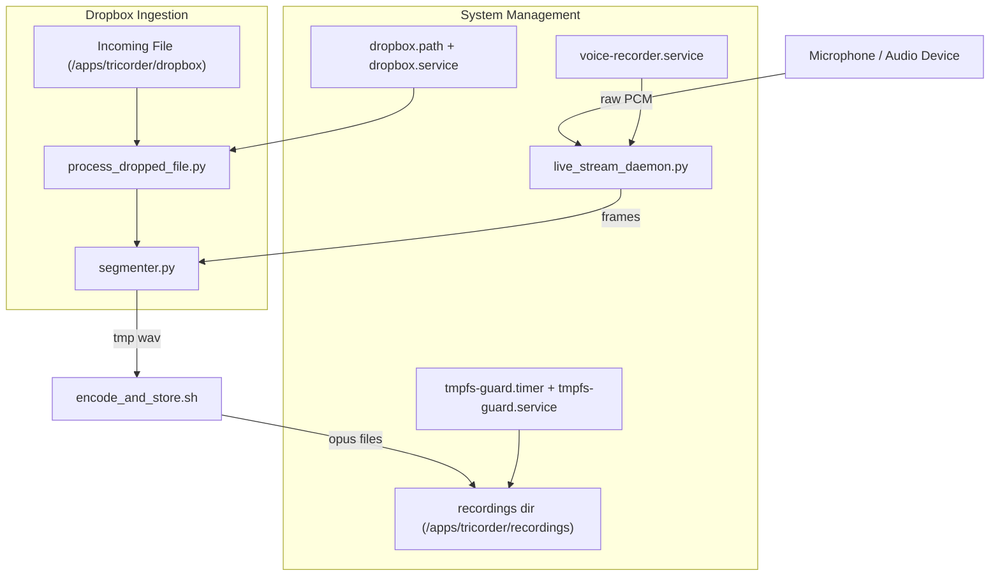

# Tricorder

Tricorder is an embedded audio event recorder designed to run continuously on a Raspberry Pi Zero 2 W.  
It listens to audio input, segments interesting activity using WebRTC VAD, encodes detected events to Opus,  
and stores them locally. Also supports dropping externally recorded events into this projects processing pipeline
for processing. 

This project is designed for **single-purpose deployment** on a dedicated device.

Note: This project is pinned to Python ≥3.10 with requirements.txt to ensure consistent builds on Raspberry Pi Zero 2W 
(armhf/arm64 wheels).

---

## Features

- Continuous low-power audio monitoring on RPi Zero 2 W
- WebRTC-based voice activity detection at 48 kHz / 20 ms frames
- Efficient encoding with `ffmpeg` (Opus @ ~48 kbps, mono)
- Event-based segmentation with pre/post roll context
- Systemd-managed services for recording, encoding, storage, and syncing
- Automatic tmpfs space guard and log rotation


---

# Tricorder Architecture



---

## Project Structure

```text
tricorder/
  bin/                # Shell utilities
  lib/                # Core Python modules
  systemd/            # Systemd unit files
  install.sh          # Installation script
  clear_logs.sh       # Manual log cleanup (deprecated, use journald limits)
  README.md           # This file

```
---

## Installation

1. Flash Ubuntu 24.04 LTS onto an SD card. Boot and connect to network.
2. Copy/Clone this repo onto the Pi. (not the install directory)
3. Run the installer:
   ```bash
   ./install.sh
   ```
   This will install dependencies, set up a Python venv, and register systemd services. It willl also nable and start services
   
---

## Configuration

- **Audio device**: Default ALSA device can be overridden via env var or specified in segmenter.py and the voice-recorder unit file:
  ```bash
  export AUDIO_DEV=hw:1,0
  ```
- **Recording parameters** (defaults are tuned for Pi Zero 2 W):
  - Sample rate: 48000 Hz, mono
  - Frame size: 20 ms (960 samples)
  - Opus bitrate: 48 kbps
- **Directories**:
  - `/apps/tricorder/recordings` → stores encoded `.opus` files
  - `/apps/tricorder/dropbox` → watched for incoming files
  - `/apps/tricorder/tmp` → transient scratch space

---

## Services

- `voice-recorder.service` → runs the recorder daemon and segments audio into events
- `dropbox.path` + `dropbox.service` → monitor Dropbox folder and ingest files from it
- `tmpfs-guard.timer` + `tmpfs-guard.service` → ensure tmpfs doesn’t fill beyond threshold
- `clear_logs.sh` → legacy; prefer journald size limits (utility script not a service)

---

## Usage

- Logs can be monitored with:
  ```bash
  journalctl -u voice-recorder.service -f
  ```
- Recordings will appear under `/apps/tricorder/recordings`.
- To test the pipeline, a self-test service/script will be added (see TODO).

---

## TODO (next improvements)

- [x] Pin Python version (≥3.10) and dependencies; add `requirements.txt` with exact versions for Pi Zero 2 W (armhf/arm64 wheels).
- [ ] Make `/apps/tricorder` paths configurable via environment variables (e.g., `REC_DIR`, `TMP_DIR`).
- [ ] Harden `dropbox.service` ingestion loop to avoid race with partial files.
- [ ] Add cleanup on encoder failures to remove temp WAVs.
- [ ] Gate debug logging behind environment variable to reduce journald volume.
- [ ] Improve `voice-recorder.service` unit: add restart policy, memory/cpu limits, and minimal security hardening.
- [ ] Review and possibly refactor USB reset logic into separate privileged oneshot service (avoid running recorder as root).
- [ ] Replace `clear_logs.sh` with journald config (`RuntimeMaxUse=50M`, `MaxFileSec=1day`).
- [ ] Make tmpfs guard threshold configurable via environment variable and log deletions to journald.
- [ ] Document audio device configuration (`arecord -l`) and how to override `AUDIO_DEV`.
- [ ] Add self-test script/service to record, encode, and verify an event end-to-end.

---

## Contributing

This project is optimized for embedded deployment. Keep changes minimal, efficient, and mindful of Pi Zero 2 W constraints (CPU, RAM, storage).
